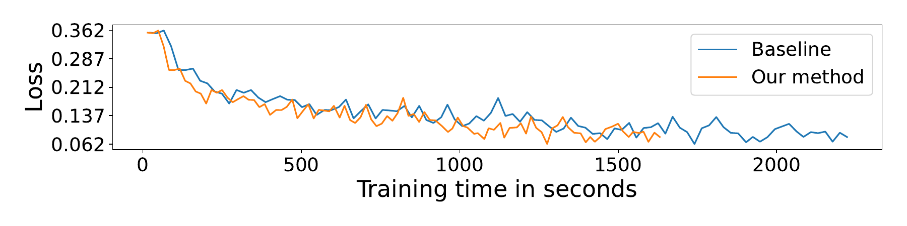

# Phasor-Driven Acceleration for FFT-based CNNs

## Project Summary

Recent research in deep learning (DL) has investigated the use of the Fast Fourier Transform (FFT) to accelerate the computations involved in Convolutional Neural Networks (CNNs) by replacing spatial convolution with element-wise multiplications on the spectral domain. These approaches mainly rely on the FFT to reduce the number of operations, which can be further decreased by adopting the Real-Valued FFT. In this paper, we propose using the phasor form—a polar representation of complex numbers, as a more efficient alternative to the traditional approach. The experimental results, evaluated on the CIFAR-10, demonstrate that our method achieves superior speed improvements of up to a factor of 1.376 (average of 1.316) during training and up to 1.390 (average of 1.321) during inference when compared to the traditional rectangular form employed in modern CNN architectures. Similarly, when evaluated on the CIFAR-100, our method achieves superior speed improvements of up to a factor of 1.375 (average of 1.299) during training and up to 1.387 (average of 1.300) during inference. Most importantly, given the modular aspect of our approach, the proposed method can be applied to any existing convolution-based DL model without design changes.

## CRV 2024 Workshop Track Paper

https://arxiv.org/abs/2406.00290

## CRV 2024 Workshop Track Poster

## Methodology

## Results

### CIFAR-10

#### Batch Processing Time Analysis

#### Transfer Learning Analysis

#### Training Loss Comparison

Training loss comparison of the proposed model w.r.t. the
baseline, based on [13], for six different networks on CIFAR-10.

##### alexnet

##### densenet-121

##### efficientnetb3

##### inception-v3

##### resnet-18

##### vgg-16

## CIFAR-100

#### Batch Processing Time Analysis

#### Transfer Learning Analysis

#### Training Loss Comparison

Training loss comparison of the proposed model w.r.t. the
baseline, based on [13], for six different networks on CIFAR-100.

##### alexnet

##### densenet-121

##### efficientnetb3

##### inception-v3

##### resnet-18

##### vgg-16

## Reference

[[13] M. Mathieu, M. Henaff, and Y. LeCun, “Fast training of
convolutional networks through ffts,” in 2nd International
Conference on Learning Representations, ICLR 2014, Banff,
AB, Canada, April 14-16, 2014, Conference Track Proceed-
ings, 2014.](https://arxiv.org/pdf/1312.5851.pdf)

## Contact

For additional information and comments, please reach out.

- Eduardo Reis
  - Dept. of Electrical and Computer Eng.
  - Lakehead University
  - Thunder Bay, Canada
  - edreis@lakeheadu.ca
